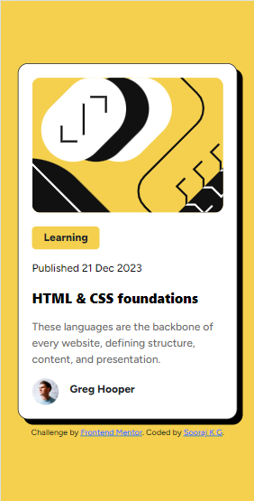
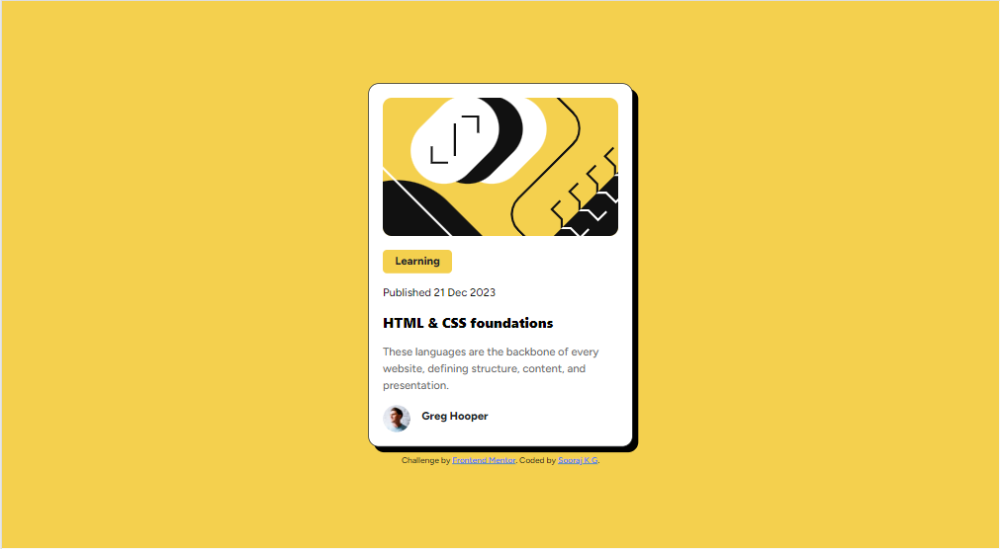
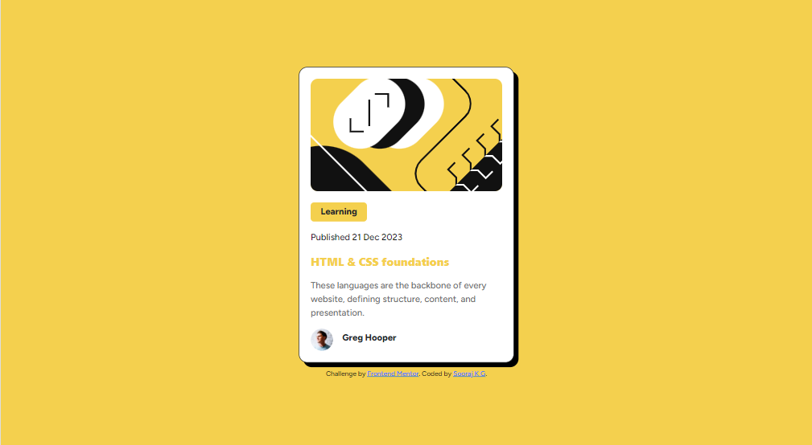

# Frontend Mentor - Blog preview card solution

This is a solution to the [Blog preview card challenge on Frontend Mentor](https://www.frontendmentor.io/challenges/blog-preview-card-ckPaj01IcS). Frontend Mentor challenges help you improve your coding skills by building realistic projects. 

## Table of contents

- [Overview](#overview)
  - [The challenge](#the-challenge)
  - [Screenshot](#screenshot)
  - [Links](#links)
- [My process](#my-process)
  - [Built with](#built-with)
- [Author](#author)
- [Acknowledgments](#acknowledgments)

## Overview

- This documentation provides an overview of the HTML and CSS code used for the Blog preview card
- The challenge was to build a blog preview card that matches the design specifications

### The challenge

Users should be able to:

- See hover and focus states for all interactive elements on the page

### Screenshot

### Links

- Live Site URL: [View the live demo](https://soorajappu.github.io/Blog-preview-card/)

## My process

### Built with

- Semantic HTML5 markup
- CSS custom properties
- Mobile-first workflow

## Author

- Frontend Mentor - [@Soorajappu](https://www.frontendmentor.io/profile/Soorajappu)

## Acknowledgments

This challenge is provided by Frontend Mentor. These challenges are excellent and have been instrumental in improving my frontend skills. Thanks to the Frontend Mentor team!

